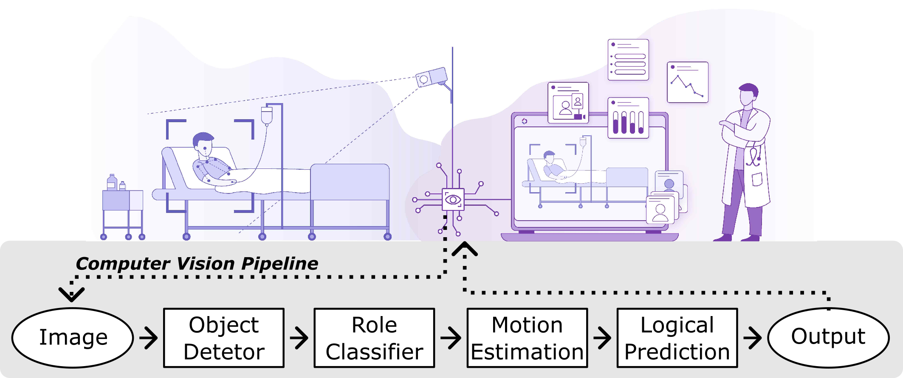
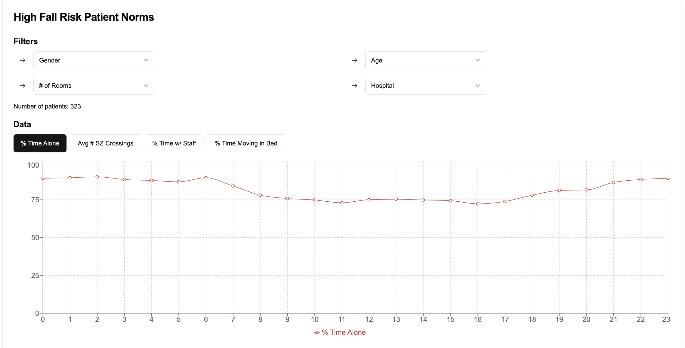

**Authors**: Paolo Gutierrez Gabriel (corresponding), Peter Rehani, Tyler Troy, Tiffany Wyatt, Michael Choma and Narinder Singh

> _The manuscript is submitted for review in 'Frontiers in Imaging - Imaging Applications'._

> **_NOTE_** [2024-12-17]: this repository and project page are under construction. 
thank you for your patience. 


# Welcome! 

_Figure 1 of pre-print article_

You are likely here because you read the titled manuscript and are looking for the public data and associated code that was mentioned. 

Thank you for your interest in analyzing these anonymized computer vision predictions, aggregated at the patient-day-hour level. 
We invite you to explore the trends reported in the manuscript (and more), and provide the materials below as support.

# Dataset
This project page is about a new, fully anonymized dataset (unnamed).
This data consists of computer vision predictions recorded from hundreds of patients over a 6-month period, aggregated at the patient-day-hour level. 



_Example trend plot, rendered in [Vercel App](https://lookdeep.vercel.app/)_

These trends provide hour-over-hour insight into various patient behvaiors and room conditions, including but not limited to:
```
**Metadata:**
- model_name
- day_loc
- hour_loc
- monitor_id
- division_name
- group_ADC
- gender
- group_age
- ts

**Data:**
- num_samples
- percent_alone
- count_fence_crossed
- percent_fence_crossed
- percent_bed_active
- percent_scene_active
- count_alone_active
- percent_alone_active
- count_alone_fence_crossed
- percent_alone_fence_crossed
- percent_staff
- percent_supervized
- percent_supervized_staff
- percent_supervized_other
- percent_supervized_staff_fence_crossed

```

*Details*:
- computer vision predictions come from Models v4 and v5 -> see manuscript for evaluation

# Resources
* [direct link to data](https://raw.githubusercontent.com/lookdeep/ai-norms-2024/refs/heads/main/data/data_by_patient_hour_scrubbed.csv) - CSV file (3.88 MB)
* [interactive demo](https://lookdeep.vercel.app/) - made with Vercel App
* [arXiv pre-print](https://arxiv.org/abs/2412.13152) 
* [code repository](https://github.com/lookdeep/ai-norms-2024) - use `main` branch
* [LookDeep Health website](https://lookdeep.health/technology/)
* code

# Citation
If you would like to reference this work, please use:
```
@misc{gabriel2024continuouspatientmonitoringai,
      title={Continuous Patient Monitoring with AI: Real-Time Analysis of Video in Hospital Care Settings}, 
      author={Paolo Gabriel and Peter Rehani and Tyler Troy and Tiffany Wyatt and Michael Choma and Narinder Singh},
      year={2024},
      eprint={2412.13152},
      archivePrefix={arXiv},
      primaryClass={cs.CV},
      url={https://arxiv.org/abs/2412.13152}, 
}
```
# Change Log
 * 2024-12-30 
    - update dataset description to include `division_name`
    - add "interactive demo" link to resources and banner
 * 2024-12-17 
    - initialize project page and link to pre-print
 * 2024-12-18 
    - update project page with dataset
